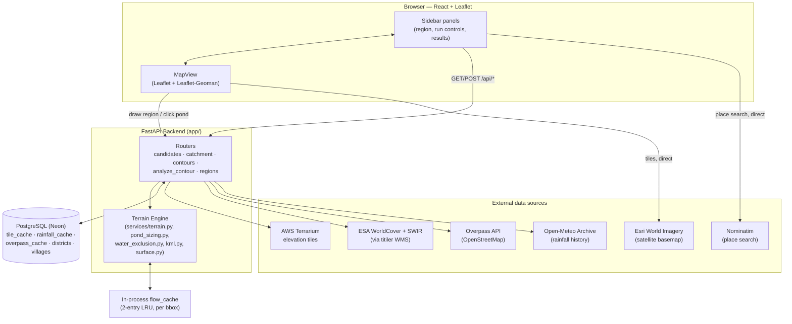
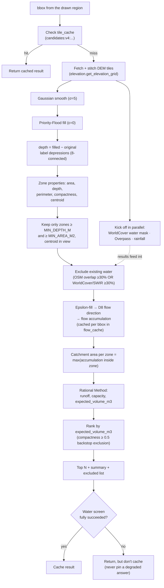
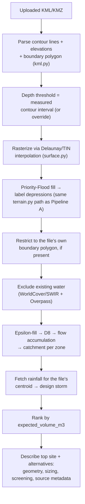
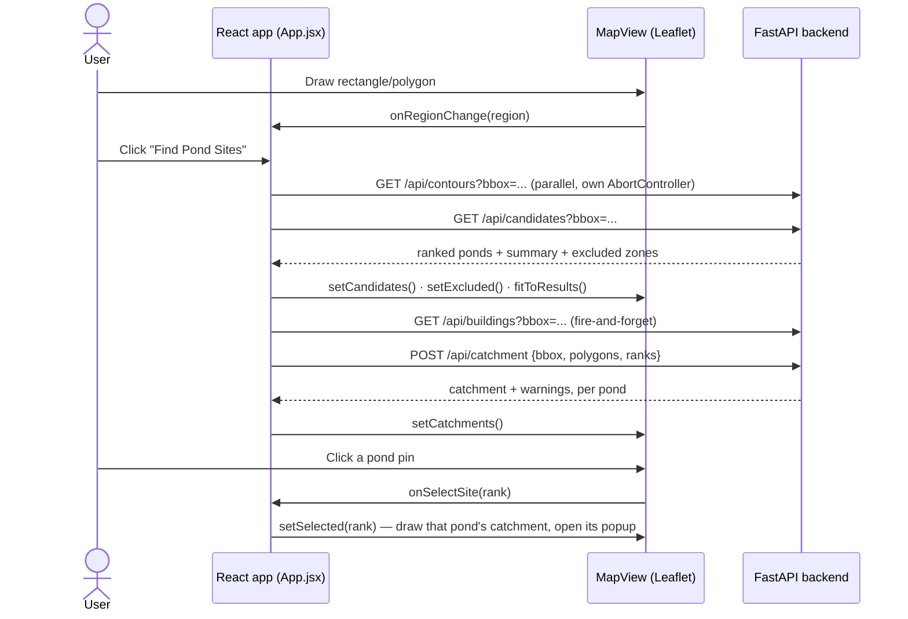

# Architecture

How the pieces fit together: the system diagram, the two analysis pipelines end-to-end, the
request lifecycle for a normal user action, and the caching layers underneath it all.

See also: [API_REFERENCE.md](API_REFERENCE.md) for endpoint details, [BACKEND_GUIDE.md](BACKEND_GUIDE.md)
for the algorithms, [FRONTEND_GUIDE.md](FRONTEND_GUIDE.md) for the UI.

---

## 1. System overview

**What talks to what directly, and why:**
- The browser fetches **map tiles** (Esri satellite, OpenStreetMap streets, place-name labels) and
  does **place search** (Nominatim) directly — these are just display and convenience, nothing for
  the backend to compute or cache.
- Everything that touches elevation, water screening, catchments or rainfall goes through the
  FastAPI backend, which checks its Postgres/in-process caches first and only calls out to an
  external source on a miss.

---

## 2. Two independent analysis pipelines

The project has **two ways in**, both converging on the same terrain engine
(`terrain.py` + `pond_sizing.py`):

| | Trigger | Elevation source | Endpoint |
|---|---|---|---|
| **A — Interactive (Phase 3)** | User draws a box/polygon on the live map | AWS Terrarium tiles, fetched for the drawn bbox | `GET /api/candidates` |
| **B — Uploaded contour map (Phase 2)** | User uploads a KML/KMZ contour file | The file's own contour lines, rasterized to a grid | `POST /api/analyzeContour` |

Both pipelines produce the same shape of result: ranked pond sites, each with a catchment, a
design-storm runoff figure, a pond capacity, and the smaller of the two as the headline
**expected water volume**.

### Pipeline A — draw-a-region (`GET /api/candidates`)

Sizing/ranking then continue identically on the client for individual pond details, and
`POST /api/catchment` is called separately per top-N site to trace and draw its exact catchment
outline (see [API_REFERENCE.md](API_REFERENCE.md#post-apicatchment) — this reuses the same
`flow_cache` entry computed above, so it doesn't repeat the epsilon-fill/D8/accumulation step).

### Pipeline B — uploaded contour map (`POST /api/analyzeContour`)

The two pipelines share every terrain/sizing function; they differ only in **where the elevation
grid comes from** (live tiles vs. an uploaded file) and in pipeline B's extra step of restricting
results to the file's own study-area boundary.

---

## 3. Request lifecycle: "Find Pond Sites"

The most common user action, end to end:

Design points worth knowing:
- **Every fetch carries an `AbortSignal`.** Redrawing the region, or clicking "Find Pond Sites"
  again, bumps a run id and aborts every in-flight request tied to the old one — a slow response
  can never draw results for a region that's no longer selected.
- **Catchments are computed for all top-N sites up front**, but only **drawn** for the pond the
  user has selected — so the map defaults to "here are the ranked locations" and only shows the
  (usually much larger) catchment area once you ask about a specific one.
- **Contours load in parallel with candidates**, not after — they're independent, so there's no
  reason to make the user wait twice.

---

## 4. Caching layers

| Layer | Where | Scope | Keyed by | Notes |
|---|---|---|---|---|
| `tile_cache` (Postgres) | elevation tiles, contour geometry, candidate results, WorldCover/SWIR images | shared, durable | source-specific (see [BACKEND_GUIDE.md](BACKEND_GUIDE.md#caching)) | No TTL — grows unbounded; invalidated only by changing the key (e.g. bumping `CACHE_VERSION`) |
| `rainfall_cache` / `overpass_cache` (Postgres) | rainfall series, OSM query results | shared, durable | rounded lat/lon (rainfall) or bbox (overpass) | Only a **successful** fetch is ever cached — a degraded/partial answer is never pinned in place |
| `flow_cache` (in-process, Python `OrderedDict`) | the epsilon-fill → D8 → accumulation result | per-process, 2-entry LRU | bbox + zoom | Shared between `/api/candidates` and `/api/catchment` for the same view, so tracing a catchment after finding candidates doesn't repeat the expensive flow solve. Not persisted — round-tripping large float arrays through Postgres was measured to cost more than just recomputing them. |
| Browser | none for analysis results | — | — | Every run re-fetches; the frontend has no client-side cache of its own beyond what's in memory for the current run |

---

## 5. Design decisions worth knowing

- **No GDAL/rasterio/pysheds.** Elevation arrives PNG-encoded (Terrarium format); the whole terrain
  engine — depression filling, D8 flow routing, contour tracing — is hand-written in numpy/SciPy/
  OpenCV. This keeps the backend pip-installable with no system-level geospatial libraries.
- **Water exclusion runs before ranking, not after.** Two independent signals (OSM mapped water,
  ESA WorldCover + Sentinel-2 SWIR satellite classification) are unioned and applied *before* the
  catchment-driven ranking step — so a river or existing tank can never be promoted to a top result
  just because "more water drains there."
- **Only cache what worked.** A partial/degraded result (e.g. WorldCover unreachable) is still
  returned to the user — with the gap disclosed in the response's `summary` flags — but is never
  written to cache, so a transient outage can't permanently degrade every future request for that
  area.
- **Pond location vs. catchment are visually and conceptually distinct on the map** (Phase 3 UI
  fix): the pond is drawn as water (blue); its catchment is drawn only once selected, in a
  different colour, labelled on the map — so the large catchment area is never mistaken for "the
  site itself."
- **Region/village/district admin-boundary endpoints exist but are unused by the current
  frontend.** `GET /api/states` / `/api/districts` / `/api/villages` (backed by `districts` and
  `villages` tables, seeded via `backend/scripts/seed_*.py`) were the original Phase 1
  location-picking UI. Phase 3 replaced that with draw-on-map + Nominatim place search, but the
  endpoints and seeded data are left in place rather than deleted, in case a "jump to a known
  place" convenience is wanted again later.
