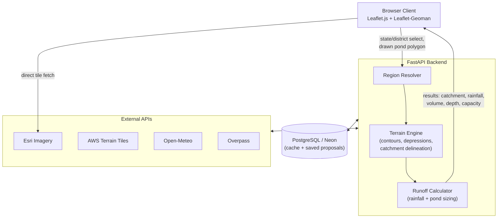

# High-Level Design — AI-based Village Pond Planning System

Assignment 1, CSD

---

## 1. Problem Statement and Objectives

**Problem Statement:** Water conservation is a major challenge in rural areas. One effective solution is
the construction of ponds at suitable locations to harvest rainwater. Selecting these locations requires
analysis of terrain elevation, catchment areas, government land availability, rainfall patterns, and
estimated storage capacity. This project develops a web application that assists village administrators in
identifying suitable locations for pond construction using geospatial and satellite data.

**Objectives:** Develop a complete web application capable of analyzing terrain and rainfall information to
recommend suitable locations for pond construction. The system should estimate catchment areas, rainfall
accumulation, pond depth, and storage capacity, and present the results through an interactive map
interface.

---

## 2. Overall System Architecture

Satellite tiles are the one thing the browser fetches directly from Esri — nothing for the backend to
compute there, only display. Everything else (region lookup, contours, candidate zones, catchment,
rainfall, sizing) runs through the FastAPI backend, which checks the Postgres cache first and only calls out to the
external APIs on a cache miss.

---

## 3. Functional Requirements and Workflow

FR1 satellite imagery · FR2 contour maps · FR3 identify suitable land · FR4 catchment area · FR5 historical
rainfall · FR6 runoff volume · FR7 pond depth/capacity · FR8 combined overlay.

**Workflow:**
1. Select state → district → map centers with satellite layer
2. Backend fetches elevation, derives contours (FR2), detects candidate low-lying zones (FR3)
3. User draws a polygon on the chosen site (human confirmation — no reliable open dataset of available/govt
   land exists, so this step replaces automatic land classification)
4. Backend computes catchment for that polygon (FR4), fetches rainfall (FR5)
5. Backend computes runoff volume (FR6) and recommends depth + capacity (FR7)
6. All results rendered together on the map (FR8)

---

## 4. Technology Stack

| Layer | Choice |
|---|---|
| Frontend | Leaflet.js + Leaflet-Geoman (polygon drawing) |
| Backend | FastAPI (Python) — async fits well since most endpoints wait on external APIs; auto-generated OpenAPI docs double as API documentation |
| Database | PostgreSQL (Neon, serverless free tier) — district data, cached API responses, and saved proposals are stored as JSONB; switched from an initial MongoDB plan since every DB access here is single-key JSON lookups with no in-DB spatial queries (all geometry compute is numpy/OpenCV), so JSONB covers the need without a separate document store |
| Imagery | Esri World Imagery (free, keyless) |
| Elevation | AWS Terrain Tiles (free, keyless, PNG-encoded — avoids a GDAL dependency) |
| Rainfall | Open-Meteo Archive (free, keyless) |
| Buildings | Overpass API / OpenStreetMap |
| Core libraries | numpy, scipy, OpenCV, Pillow, requests |

No GDAL/rasterio/pysheds — elevation arrives as PNG and the terrain algorithms (fill, flow routing) are
implemented directly in numpy, which keeps the whole stack pip-installable.

---

## 5. API Design

### 5.1 Internal API (FastAPI backend)

All responses are JSON; all geometry is GeoJSON in WGS84 with `[lon, lat]` ordering. `bbox` is passed as
`minLon,minLat,maxLon,maxLat`. Every endpoint that touches an external service checks the Postgres cache
first, keyed by region/bbox, and only calls out on a miss.

| Method | Endpoint | Request | Response | Work behind it |
|---|---|---|---|---|
| GET | `/api/states` | — | List of states/UTs | Postgres lookup (seeded from `india.geojson`) |
| GET | `/api/districts?state=` | state name | Districts, each with centroid + bbox | Postgres lookup; centroid is what the map centers on (FR1) |
| GET | `/api/contours?bbox=&interval=` | bbox, band interval (m) | `FeatureCollection` of contour rings, each tagged with its elevation | Fetch terrain tiles → decode → smooth → threshold per band → `findContours` (FR2) |
| GET | `/api/candidates?bbox=&min_depth=&min_area=` | bbox, depth/area thresholds | `FeatureCollection` of depressions, ranked | Priority-Flood fill → `depth = filled − original` → connected components (FR3) |
| GET | `/api/buildings?bbox=` | bbox | `FeatureCollection` of building footprints | Overpass passthrough + cache; drawn as a warning layer, not a hard filter |
| POST | `/api/catchment` | user-drawn polygon (GeoJSON) | Catchment polygon + `area_ha`, pour-point coords | Epsilon fill → D8 → flow accumulation → upstream flood-fill (FR4) |
| GET | `/api/rainfall?lat=&lon=&years=` | point + lookback window | Annual mean total, max single-day, series metadata | Open-Meteo Archive + cache (FR5) |
| POST | `/api/pond-plan` | pond polygon, catchment area, rainfall figures | Runoff volume, recommended depth, capacity, capture % | Rational Method, then capacity vs. volume (FR6, FR7) |
| POST | `/api/proposals` | Full result set for one site | `proposal_id` | Insert into Postgres |
| GET | `/api/proposals/<id>` | proposal id | The saved proposal | Postgres lookup |

Three of these carry the design decisions that matter:

- **`/api/candidates`** returns per-zone `area_ha`, `max_depth_m`, `mean_depth_m`, `perimeter_m`,
  `compactness` and `centroid` alongside the geometry. Compactness (`4π×area/perimeter²`) is what
  separates a genuine bowl from a stream corridor, so it is returned rather than only used internally —
  the frontend ranks on it.
- **`/api/catchment`** takes the user's polygon, not a point. The pour point is chosen as the
  highest-flow-accumulation cell *inside* that polygon; it is returned in the response so the choice is
  inspectable rather than hidden.
- **`/api/pond-plan`** deliberately does not solve for pond footprint. Area comes in fixed (the drawn
  polygon), depth comes from a standard range, and the endpoint reports what fraction of the design storm
  that pond would capture.

### 5.2 External APIs consumed

| Service | Endpoint | Auth | Used for | Called by |
|---|---|---|---|---|
| Esri World Imagery | `server.arcgisonline.com/.../World_Imagery/MapServer/tile/{z}/{y}/{x}` | keyless | Satellite basemap (FR1) | Browser, directly |
| AWS Terrain Tiles | `s3.amazonaws.com/elevation-tiles-prod/terrarium/{z}/{x}/{y}.png` | keyless | Elevation for FR2, FR3, FR4 | Backend |
| Open-Meteo Archive | `archive-api.open-meteo.com/v1/archive` | keyless | Daily historical precipitation (FR5) | Backend |
| Overpass / OSM | `overpass-api.de/api/interpreter` | keyless | Building footprints, exclusion warning layer (FR3) | Backend |

Practical notes on each, all found during testing:

- **Esri** uses `{z}/{y}/{x}` — the y/x order is reversed relative to the OSM convention used elsewhere in
  the stack. Verified georeferenced at both district zoom (z14) and site zoom (z18); the backend never
  proxies these tiles, so imagery costs the server nothing.
- **AWS Terrain Tiles** encode elevation per pixel as `R×256 + G + B/256 − 32768`. Same Web Mercator grid
  as the imagery, so the two align without any georeferencing step. Hard ceiling: z16 returns 404, so
  z15 (~4.45 m/px at this latitude) is the finest elevation available no matter how far the imagery zooms.
- **Open-Meteo** is the only external call that needs no decoding — clean JSON straight back. Queried with
  `daily=precipitation_sum` over a multi-year range; both the annual mean and the max single-day value are
  derived from that one series. A full-year rural test returned 366/366 days with no gaps.
- **Overpass** is the one service that can throttle under load. Cached per region and treated as a soft
  failure — if it is unavailable the map loses its building warning layer but the analysis still runs.

### 5.3 APIs evaluated and rejected

| Candidate | Why not |
|---|---|
| mghydro Global Watersheds | Works, keyless, tested live — but runs on ~90 m MERIT-Hydro. Returned 37 km² for a test point needing hectares; a farm-scale depression isn't resolvable at that pixel size |
| India-WRIS | Catchment boundaries published for large river basins only — same scale mismatch |
| Esri ArcGIS Watershed service | Paid ArcGIS Online utility service, consumes credits; not keyless |
| Any contour API | None found that returns contour geometry directly — hence deriving it from elevation |
| Government/available-land parcels | No open dataset exists for India, which is why FR3 ends in a human-drawn polygon |

---

## 6. Algorithms / Methodology

- **Tile math:** satellite + elevation both use the same Web Mercator slippy-tile grid, so they align
  pixel-for-pixel with no manual georeferencing
- **Elevation decoding:** `elevation = R×256 + G + B/256 − 32768` (Terrarium PNG encoding)
- **Contours:** threshold the elevation grid per band → `cv2.findContours` → `approxPolyDP` → lat/lon
- **Depression detection:** Priority-Flood (Barnes et al., 2014) — standard hydrology pit-filling
  algorithm, structurally Dijkstra's algorithm applied to elevation. `depth = filled − original` marks
  natural low points, which become FR3's candidate zones
- **Catchment delineation:** epsilon-adjusted fill → D8 flow direction → flow accumulation → pour point =
  highest-accumulation cell inside the user's polygon → flood-fill upstream along reversed flow directions
- **Runoff/sizing:** Rational Method, `V = A × P × C`, using design-storm rainfall (not annual total); pond
  depth from a standard practical range, area from the user's polygon, output as % of design storm captured

---

## 7. Expected Challenges and Solutions

| Challenge | Solution |
|---|---|
| No contour API exists | Derive from elevation data via OpenCV |
| No open dataset of available/govt land | Human-in-the-loop: user draws the final polygon |
| No catchment API works at village-pond scale (tested one — returns 90m-resolution basin-scale results) | Hand-rolled D8 + flow accumulation on our own meter-scale elevation grid |
| OpenTopography now requires a key | Switched to keyless AWS Terrain Tiles |
| Elevation data capped at zoom 15 (~4.5m/px) | Accepted as a known resolution limit |
| Naive depression-filling doesn't converge | Switched to Priority-Flood |
| Filled depressions are flat, breaking flow direction | Added a small epsilon gradient during filling |
| Flat-colored contours don't show which side is higher | Color by elevation value with a legend |
| Area-only ranking puts stream corridors at the top of candidate list | Add a compactness filter to favor bowl-shaped zones |
| Wrong pour-point choice gives a nonsensically small catchment | Use highest-accumulation point inside the polygon, not lowest elevation |
| D8 unreliable on flat/urban terrain | Flagged as an open item — needs validation on higher-relief rural data |
| Annual-rainfall sizing produces absurd pond dimensions | Size against design-storm (max single-day) rainfall instead |
| Deriving footprint from volume gives unusable dimensions | Fix depth + area, report % of storm captured instead |
| Runoff coefficient / standard depth are currently assumed | Needs a citable source (MGNREGA/ICAR) before final submission |
| Overpass can throttle | Cache per region; treat as a soft warning, not a hard failure |
